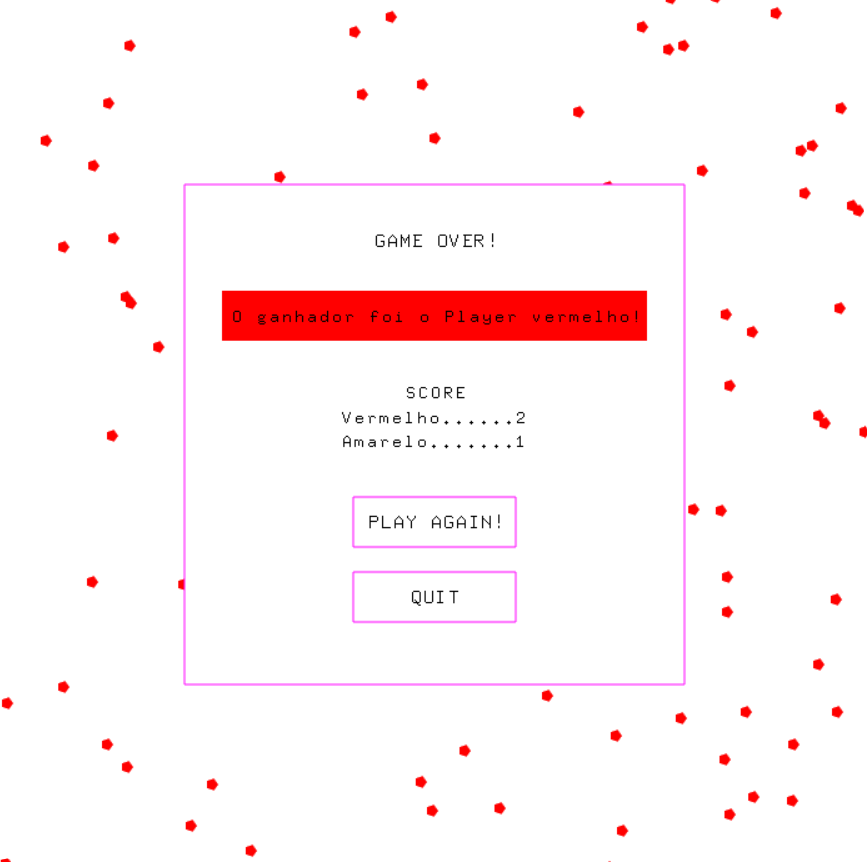

<h1>Jogo Connect 4</h1>

Este jogo foi desenvolvido durante as aulas de Lógica e Algoritmo do 1º semestre de Sistemas de Informação, com o professor Cesar Pozzer.

O jogo faz uso da API gráfica Canvas2D, que roda em OpenGL e Glut.

